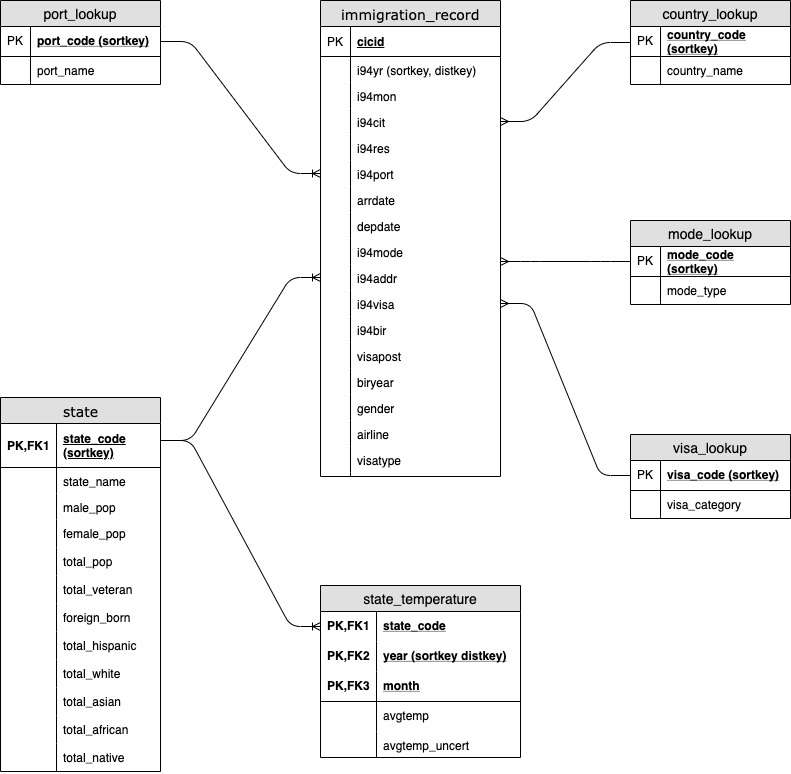
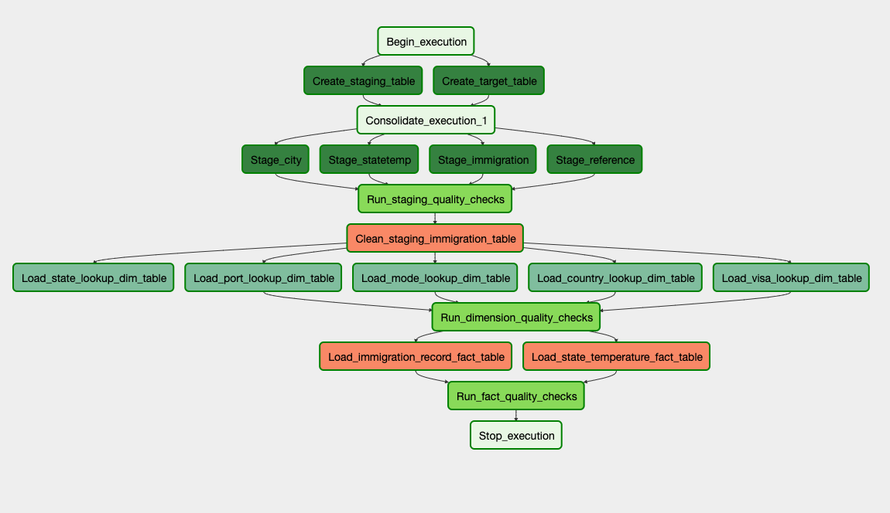

# Project: Capstone

## Introduction
This is a project to combine all the skill that we have learned through the whole program and design an end-to-end data solution to provide data warehousing, ETL for further analytical use case.

The core data given includes US i94 immigration records and historical US geographical temperature data. In supplementary, there are US city demographic and US airport code information.

### Raw Data
- **Immigration Data**: The data is stored in Parquet format on S3 location "s3://udacity-capstone-hongt/data/immigration/"

- **Temperature Data**: The data is stored in CSV format on S3 location "s3://udacity-capstone-hongt/data/temperature/"

- **City Geographical Data**: The data is stored in CSV format on S3 location "s3://udacity-capstone-hongt/reference/us-cities-demographics.csv"

- **Immigration Data Dictionary**: The data is stored in CSV format on S3 location "s3://udacity-capstone-hongt/reference/reference.csv"

## Project Content

### 1. Data Loading and Exploration

#### 1.1 Data Loading:
Airflow is used in this step to load raw data into staging tables, without doing any manipulation. We are not applying any filtering or deduplication at this stage

#### 1.2 Data Cleaning:
After loading raw data into staging tables, we will take one step to remove duplicates on column that will be used to create primary key. 

### 2. Define the Data Model

#### 2.1 Conceptual Data Model
We will be using Star Schema in this project. The data will be centered around two fact tables and five dimension tables:  

**Fact Table**:  
- immigration\_record: i94 entry data table  
- state\_temperature: Monthly state temperature data  

**Dimension Table**:  
- port\_lookup: Entry port data dictionary  
- country\_lookup: i94cit/i94res country data dictionary  
- mode\_lookup: i94mode data dictionary  
- visa\_lookup: i94visa data dictionary 

#### 2.2 Mapping Out Data Pipelines
The data pipeline will consist below steps:  
- Load data into staging table  
- Check staging table row count  
- Clean data in staging table  
- Load data into fact and dimension table  
- Check fact/dimension table row count

### 3. Build Pipeline

#### 3.1 Pipeline tool selection
Airflow is chosen in this case as it has:  
- Capacity of connection to both S3 and Redshift  
- Capacity of scaling up  
- Capacity of scheduling to run at different frequency  
- Capacity of rerun/catchup a historical date

#### 3.2 Pipeline layout

### 4. Extended questions:
**Propose how often the data should be updated and why:  **  
Since the data provided (immigration and temperature) is in monthly frequency, the current pipeline design should be set to run at monthly frequency.

**Write a description of how you would approach the problem differently under the following scenarios:**  
- **The data was increased by 100x: ** We can scale up the number of instances that airflow is set up on  
- **The data populates a dashboard that must be updated on a daily basis by 7am every day: **  
        -  Set up DAG rerun if occurs a failure  
        -  Send email alert on failure and long SLA to notify operators  
        -  Freeze dashboard until next successful DAG run   
- **The database needed to be accessed by 100+ people.**  
        -  Set up load balancing  
        -  Set up auto-scaling on Redshift